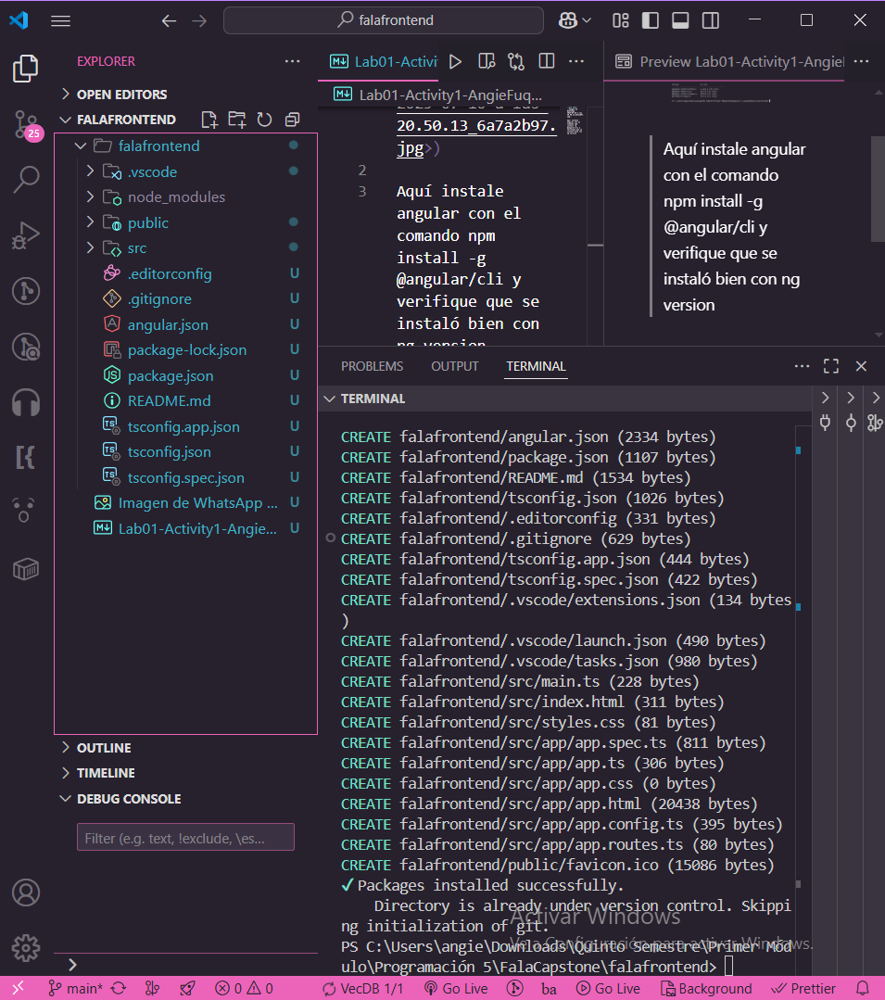

En este caso, ya tengo implementado la instalación de Node.js y npm

## Node

## npm

También ya tengo instalado nvm y varias versiones de Node.js entonces cambie la versión más reciente para comparar

## Comparación entre versiones

| Característica                   | 18.20.8 (LTS)                         | 22.12.0 (Current)                  |
| -------------------------------- | ------------------------------------- | ------------------------------------ |
| **Estado**                       | LTS (Soporte a Largo Plazo)           | Última versión "Current"           |
| **npm**                          | 10.8.2                                | 10.x o superior (según build)        |
| **ECMAScript**                   | Hasta ES2022                          | Hasta ES2024                         |
| **fetch global**                 | Experimental (--experimental-fetch)   | Estable                            |
| **Test Runner (node:test)**      | Experimental                          | Estable                            |
| **V8 Engine**                    | v10.2                                 | v12.x → Mejoras de rendimiento      |
| **Top-level await**              | Soportado                             | Soportado                            |
| **WebStreams, Blob, File**       | Parcial o experimental                | Estable                            |
| **import.meta.resolve()**        | No disponible                         |  Disponible                         |
| **Snapshots de Node.js**         | No                                    |  Sí (para mejorar tiempos de carga) |
| **Node-API (N-API)**             | v9                                    | v12                                  |
| **Soporte a WASI**               | Experimental                          | Más estable                        |
| **Seguridad**                    | Muy estable                           | Últimos parches, pero con cambios    |

Esta es la versión de VSC

---

## Creación del proyecto Node.js

Aquí cree de manera automática el proyecto con el comando npm init -y, esto crea el package.json ocn valores por defecto

## Mejores prácticas al inicializar un proyecto Node.js

1. Se debe inicializar el proyecto con npm init de forma controlada.
Aunque el comando npm init -y permite generar rápidamente un archivo package.json con valores por defecto, se recomienda ejecutar npm init sin el flag -y para completar los campos manualmente y establecer información clara como el nombre del proyecto, versión, descripción, punto de entrada, autor y licencia.

2. Se debe mantener una estructura de carpetas organizada desde el inicio.
En proyectos que podrían escalar, es recomendable establecer una estructura básica que incluya carpetas como src/, controllers/, routes/, y services/. Esto facilita la escalabilidad, mantenibilidad y legibilidad del código.

3. Se debe crear un archivo .gitignore adecuado.
Es fundamental excluir archivos y carpetas que no deben subirse al repositorio, como node_modules/, archivos de configuración locales (.env) y archivos temporales. Esto se hace mediante un archivo .gitignore en la raíz del proyecto.

4. Se debe definir el sistema de módulos que se va a utilizar.
En el archivo package.json, puede definirse "type": "module" si se desea utilizar sintaxis import/export. Si no se define, Node.js usará CommonJS por defecto (require, module.exports).

5. Se deben separar las dependencias según su propósito.
Las dependencias necesarias para ejecutar la aplicación deben instalarse normalmente (npm install paquete). Las herramientas de desarrollo como nodemon, eslint o jest deben instalarse como dependencias de desarrollo (npm install --save-dev).

6. Se debe incluir un archivo README.md.
Este archivo debe documentar al menos la descripción del proyecto, instrucciones de instalación, comandos de uso y nombre del autor. Esto facilita que otras personas puedan entender y colaborar en el proyecto.

7. Se deben establecer scripts personalizados en package.json.
Definir scripts como "start" y "dev" permite ejecutar comandos comunes de forma más simple y estandarizada. Por ejemplo:

8. Se debe utilizar control de versiones desde el inicio.
Usar git init para versionar el proyecto permite registrar cambios de forma progresiva, facilitando la colaboración y el control de errores.

## Primer Script en Node.js

acá ejecute el script para verificar el funcionamiento 